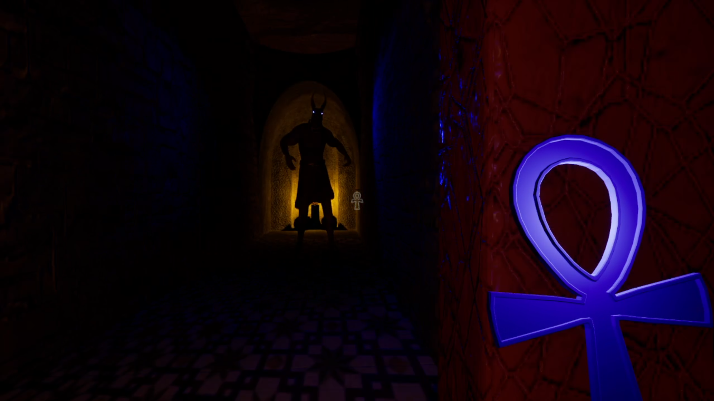

# ProjectXCAPE
**A 3D First-Person Puzzle Horror Game**


*Final Project for Game Engine III Course - College LaSalle*

---

## Game Overview

ProjectXCAPE is an immersive first-person adventure game set in an ancient Egyptian tomb. Players must navigate through atmospheric corridors, solve intricate puzzles, and evade the supernatural guardian Anubis while searching for mystical artifacts to escape the tomb alive.

**Key Features:**
- **Atmospheric Egyptian tomb environment** with detailed textures and lighting
- **Dynamic AI enemy** (Anubis) with intelligent behavior patterns
- **Complex puzzle mechanics** involving artifact collection and placement
- **Inventory management system** with item inspection capabilities
- **Advanced interaction system** with context-sensitive UI feedback

---

##  Technical Architecture

### Core Systems & Components

#### **Character Controller (`ProjectXcapeCharacter`)**
- **Enhanced Input System**: Modern Unreal Engine 5 input handling with multiple mapping contexts (Default, Inspect, Pause)
- **Advanced First-Person Controls**: Smooth movement, looking, and interaction mechanics
- **Inventory Management**: Dynamic array-based system with cyclic navigation and item persistence
- **Item Inspection System**: 3D object examination with rotation controls and detailed UI feedback
- **AI Perception Integration**: Stimulus source component for enemy detection mechanics

#### **AI System (`Anubis` + `AIC_Anubis`)**
- **Behavior Tree Implementation**: Complex AI controller using Unreal's behavior tree system
- **Waypoint Navigation**: Intelligent patrolling with ordered waypoint system
- **Player Detection**: AI perception system with sight-based detection and dynamic radius adjustment
- **Animation Integration**: Custom animation montages with notify events for attack timing
- **Dynamic Light System**: Eye lights that respond to AI state changes (Blue/Red materials)


*Anubis AI Behavior Tree showing the complex decision-making system*


*Anubis - The supernatural guardian of the tomb*


*Anubis encounters when player has the Ankh of Protection equipped*

#### **Interaction Framework**
- **Interface-Based Design**: Clean `IInteractible` and `IInventoryItem` interfaces for modular interactions
- **Ray Casting System**: Precise object detection using collision queries with 180-unit range
- **Context-Sensitive UI**: Dynamic display of interaction prompts and object information
- **Tag-Based Classification**: Efficient object categorization using Unreal's tag system


*Item inspection mode showing detailed 3D object examination*


*Context-sensitive UI implementation for object interactions*

#### **Puzzle System (`PuzzleDoor`, `StoneTablet`, `StoneTabletSlot`)**
- **Modular Puzzle Design**: Component-based puzzle pieces that can be easily reconfigured
- **Event-Driven Architecture**: Delegate-based communication between puzzle components
- **State Management**: Robust checking system for puzzle completion validation
- **Visual Feedback**: Immediate response to player actions with door opening animations

#### **Inventory Items & Artifacts**
- **Ankh System**: Special artifact with integrated lighting and perception effects
- **Stone Tablets**: Multi-variant puzzle pieces with unique identifiers and textures
- **Torch Mechanics**: Dynamic flame effects with extinguishing capabilities
- **Gem Collection**: Various collectible items with detailed material systems

### **Technical Highlights**

- **Memory Management**: Proper object lifecycle management with smart pointers and UPROPERTY declarations
- **Performance Optimization**: Efficient collision detection with targeted object type queries
- **Material System**: Dynamic material switching for visual state representation
- **Animation Framework**: Custom animation notify classes for precise event timing
- **Component Architecture**: Modular design following Unreal Engine best practices

---

## Development Experience & Challenges

### **Key Challenges Overcome**

#### **1. AI Behavior Complexity**
**Challenge**: Creating an intelligent enemy that could patrol, detect the player, and respond appropriately to different game states.

**Solution**: Implemented a sophisticated behavior tree system with custom task nodes (`BTTask_ChasePlayer`, `BTTask_FindNextWaypoint`) and blackboard-driven state management. The AI dynamically adjusts its sight radius based on player equipment (Ankh reduces detection range), creating strategic gameplay depth.

#### **2. Dynamic Inventory System**
**Challenge**: Developing a robust inventory that could handle multiple item types with different properties and interactions.

**Solution**: Created an interface-based system (`IInventoryItem`, `IInteractible`) allowing for clean polymorphism. Items are stored in a TArray with cyclic navigation, and each item maintains its own state and behavior through interface implementation.

#### **3. Complex Interaction Framework**
**Challenge**: Building an interaction system that felt intuitive while supporting multiple item types and states.

**Solution**: Implemented a ray casting system with real-time UI feedback. The system uses collision queries to detect interactable objects and displays context-sensitive information through a custom widget system (`PlayerWidget`).

#### **4. Puzzle State Management**
**Challenge**: Ensuring puzzle components communicated effectively without tight coupling.

**Solution**: Utilized Unreal's delegate system for event-driven communication. The `PuzzleDoor` subscribes to slot update events, allowing for modular puzzle design that can be easily extended or modified.

### **Collaboration & Asset Integration**

Worked closely with a skilled 3D artist to bring the Egyptian tomb environment to life:

- **Environment Design**: Collaborated on creating atmospheric corridor systems, tomb chambers, and architectural details
- **Anubis Character**: Integrated high-quality character model with custom animations and material systems
- **Asset Pipeline**: Established efficient workflows for importing and optimizing 3D assets within Unreal Engine
- **Visual Cohesion**: Ensured technical implementation supported the artist's vision while maintaining performance standards

This collaboration taught me valuable skills in cross-disciplinary communication and the importance of technical constraints in asset creation pipelines.

### **Technical Problem-Solving Examples**

#### **Animation Event System**
Developed custom `AnimNotify` classes (`AnimNotify_SpawnTrigger`, `AnimNotify_DespawnTrigger`) to precisely control Anubis's attack hitbox timing, ensuring fair gameplay while maintaining visual impact.

#### **Performance Optimization**
Implemented efficient object pooling for inventory items and optimized collision detection by using specific object type queries rather than broad trace calls.

#### **Memory Management**
Properly managed object lifetimes using UPROPERTY macros and Unreal's garbage collection system, preventing memory leaks in the dynamic inventory system.

---

## Skills Demonstrated

### **C++ Programming**
- **Object-Oriented Design**: Clean inheritance hierarchies and interface implementations
- **Memory Management**: Proper use of Unreal's object system and smart pointers
- **Performance Optimization**: Efficient algorithms and data structures for real-time gameplay

### **Unreal Engine 5**
- **Blueprint Integration**: Seamless C++/Blueprint workflow for rapid iteration
- **Component Architecture**: Modular design following engine best practices
- **Asset Pipeline**: Efficient content creation and optimization workflows

### **Game Development**
- **AI Programming**: Behavior trees, pathfinding, and perception systems
- **UI/UX Design**: Intuitive player interfaces with real-time feedback
- **Gameplay Programming**: Complex interaction systems and state management

### **Game Design**
- **Puzzle Design**: Created interconnected multi-layered puzzles requiring strategic thinking and exploration
- **Progression Systems**: Designed tablet collection mechanics that unlock new areas through door puzzles
- **Color-Based Magic System**: Innovative gem/brazier/torch color-matching mechanics revealing hidden passages
- **Risk/Reward Mechanics**: Ankh protection system creating strategic choices against Anubis encounters
- **Backtracking Incentives**: Prying tool design encouraging revisitation of previous areas for thorough exploration
- **Environmental Storytelling**: Integrated narrative elements through puzzle placement and magical wall reveals
- **Player Agency**: Multiple solution paths and discovery-based progression that rewards curiosity


*Huge Brazier with colored gems system - part of the color-based magic mechanics*

### **Project Management**
- **Cross-Disciplinary Collaboration**: Effective communication with artists and designers
- **Version Control**: Proper asset and code management workflows
- **Documentation**: Clear code documentation and system architecture design

---

##  Project Structure

```
Source/ProjectXcape/
├── Public/                     # Interface definitions
│   ├── Interactible.h         # Core interaction interface
│   └── InventoryItem.h        # Inventory item interface
├── Private/                    # Implementation files
│   ├── Character & Player/
│   │   ├── ProjectXcapeCharacter.cpp/h    # Player controller
│   │   ├── PlayerWidget.cpp/h             # UI system
│   │   └── CameraShake.cpp/h              # Screen effects
│   ├── AI System/
│   │   ├── Anubis.cpp/h                   # Main enemy character
│   │   ├── AIC_Anubis.cpp/h               # AI controller
│   │   ├── AnubisWaypoint.cpp/h           # Patrol system
│   │   └── BT Tasks/                      # Behavior tree nodes
│   ├── Inventory Items/
│   │   ├── Ankh.cpp/h                     # Mystical artifact
│   │   ├── StoneTablet.cpp/h              # Puzzle pieces
│   │   ├── Torch.cpp/h                    # Light source
│   │   └── Various collectibles/
│   ├── Puzzle System/
│   │   ├── PuzzleDoor.cpp/h               # Main puzzle controller
│   │   ├── StoneTabletSlot.cpp/h          # Puzzle slots
│   │   └── Related components/
│   └── Animation/
│       └── AnimNotify classes/            # Animation event handlers
└── Game Framework/
    ├── ProjectXcapeGameMode.cpp/h         # Game rules
    └── ProjectXcapePlayerController.cpp/h  # Input handling
```

---

## Academic Context

This project was developed as the capstone assignment for the **Game Engine III** course at **College LaSalle**, focusing on:

- Advanced C++ programming in a game engine context
- Complex system integration and architecture design
- Performance optimization and memory management
- Cross-disciplinary collaboration and project management
- Industry-standard development practices and workflows

The project demonstrates mastery of professional game development techniques and readiness for industry-level challenges.

---

*Developed by François Brinck-Boucher with the help of George Komborozos for 3D assets 
📧 f.brinck.boucher@gmail.com | 🔗 [[LinkedIn Profile]](https://www.linkedin.com/in/fran%C3%A7ois-brinck-boucher-10868a332?lipi=urn%3Ali%3Apage%3Ad_flagship3_profile_view_base_contact_details%3B22%2ByTWKHSHWjwXp1MmRy4w%3D%3D) | 🎮 [Portfolio in progress]*
